# Project: Vehicle Detection and Tracking

## Table of contents
1. [Overview](#overview)
2. [Dataset Exploration](#dataset)
3. [Feature Extraction](#feature-extraction)
4. [Classification](#classification)
5. [Sliding Window Search](#sliding-window)
6. [Test Images](#test-images)
7. [Video Implementation](#video-implementation)
8. [Discussion](#discussion)

Overview
---
The goal of this project is to detect the cars on the street.

Dataset Exploration
---
Dataset consists of two classes vehicles and non-vehicles. In the vehicle class there are `8792` images and in non-vehicle class there are `8968` images. Each image is of size `64x64x3`. Images of some random data is shown below

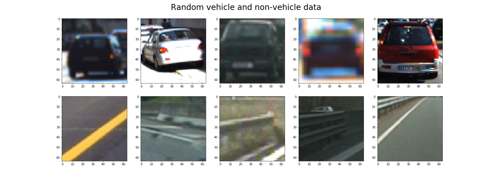

Feature Extraction
---
Steps followed in feature extraction

* Input image is converted to `YCbCr` colorspace
* Spatial binning of images to size `(16, 16)`
* Histogram features of only Y channel with `32` bins
* Histogram of Oriented Gradients. Parameters used are: orientations: `9`, pixel per cell: `16`, cells per block: `2`

### Original image of both vehicle and non-vehicle class

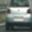 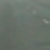

### YCbCr colorspace images

 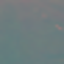

### Spatial binning images

 

### Histogram features images

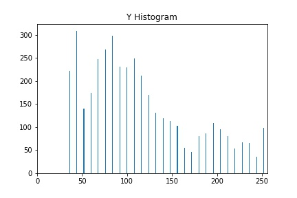 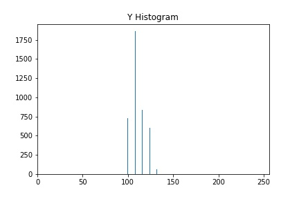

### Histogram of Oriented Gradients images

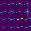 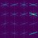

For HOG I chose the parameters as orientation bins: `9`, pixel per cells: `16` and cells per block: `2`. 

I tried other parameters by setting pixel per cells to `8` and cells per block to `4`. This combination resulted in more features and more of false positives and training time and frame by frame detection is slower.
I tried this parameter with `LUV` colorspace but again in some frame it was detecting the green sign board as a vehicle.

The other combination I tried was using pixel per cells as `8` and cells per block as `2`. But even this resulted in more false positives.
So I decided to choose pixel per cells as `16` and cells per block as `2` with YCrCb color space as it provided more reliable results.

Classification
---
For classification I used the SVM classifier from sklearn with default parameters. For training set I had in total 80% of the total samples and for validation I reserved 20% of the samples with random shuffling. The final size of the train and validation sets are: `(14208, 1124)` and `(3552, 1124)` respectively. The features are normalized before giving it to the classifier. After training, the validation accuracy turned out to be 99.2% ~ 99.4%.

Sliding Window Search
---
Sliding windows are defined at `3` scales with window sizes of `(64, 64)`, `(96, 96)` and `(128, 128)` with different starting and ending positions and with different overlapping areas.
The resulting image looks like this

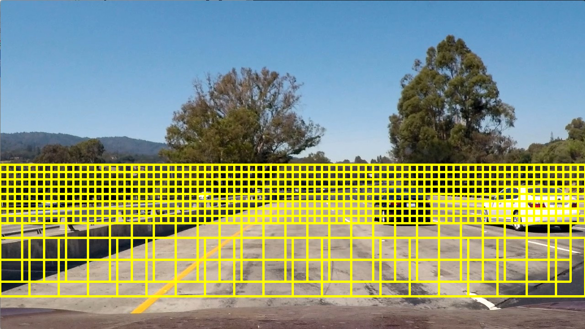

Test Images
---
| Original image | Possible window detections | Heatmap | Final Output |
|:--------------:|:--------------------------:|:-------:|:------------:|
|  | 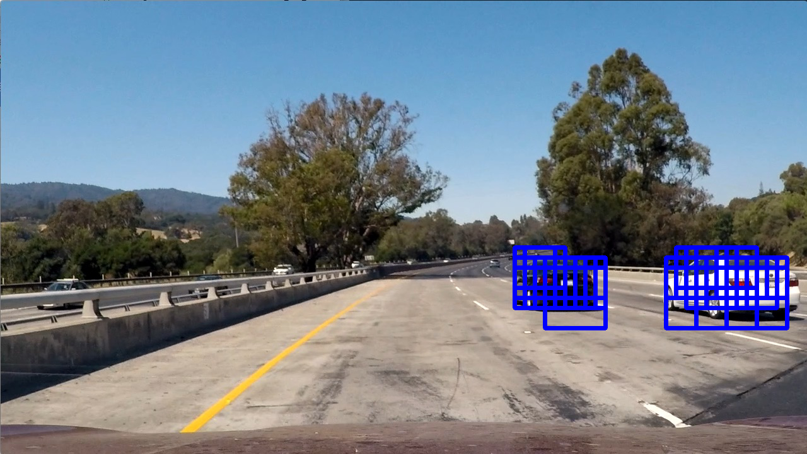 |  | 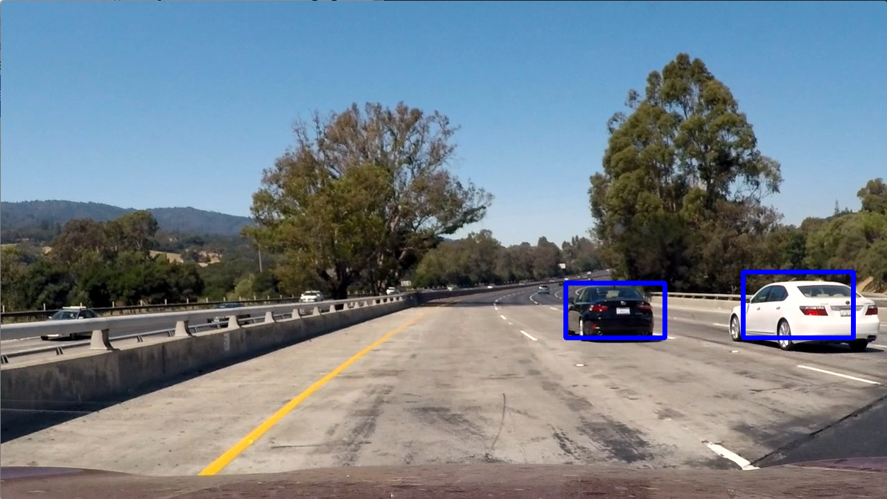 |
|  |  |  |  |
|  | 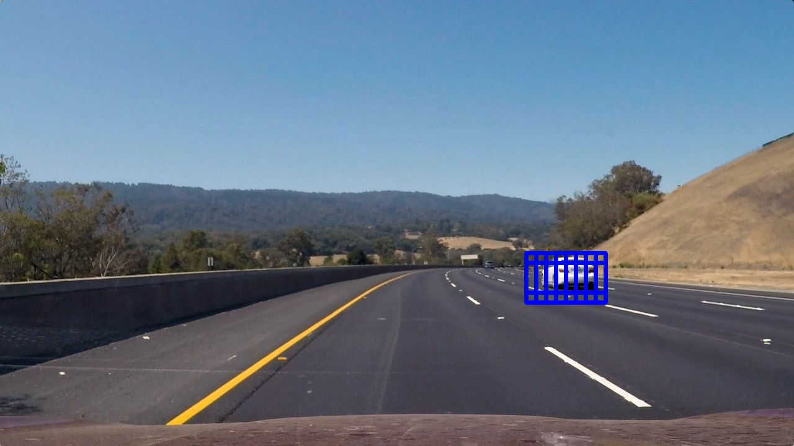 |  | 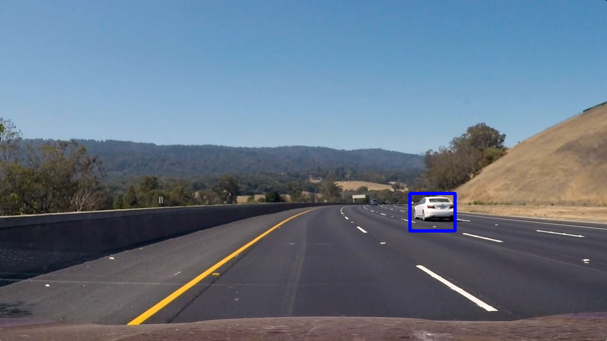 |
|  | 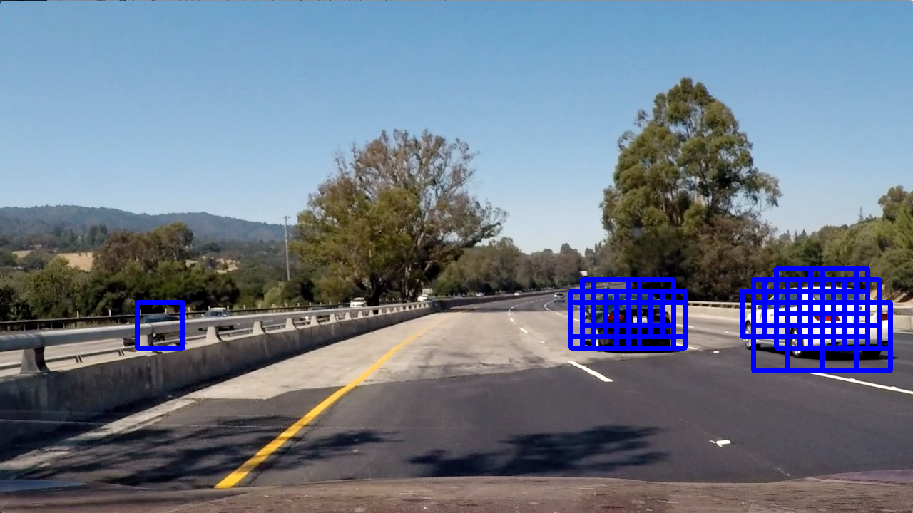 |  | 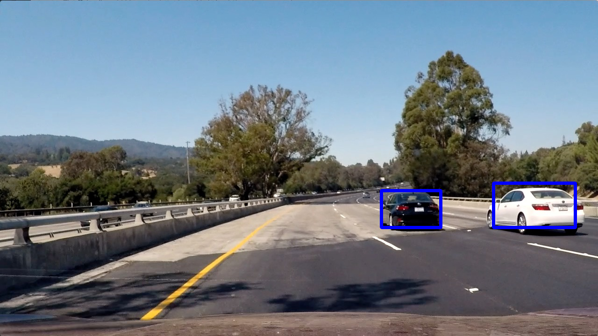 |
|  | 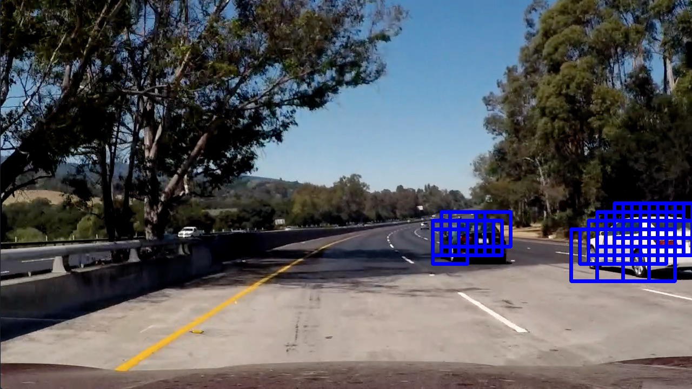 |  | 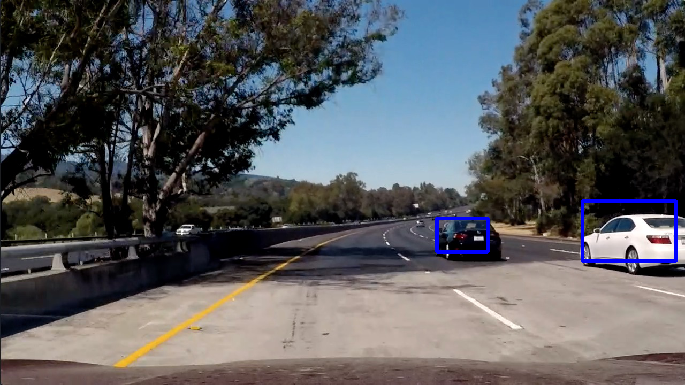 |
|  | 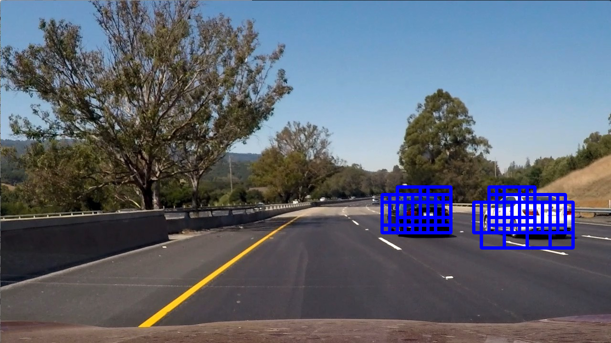 |  | 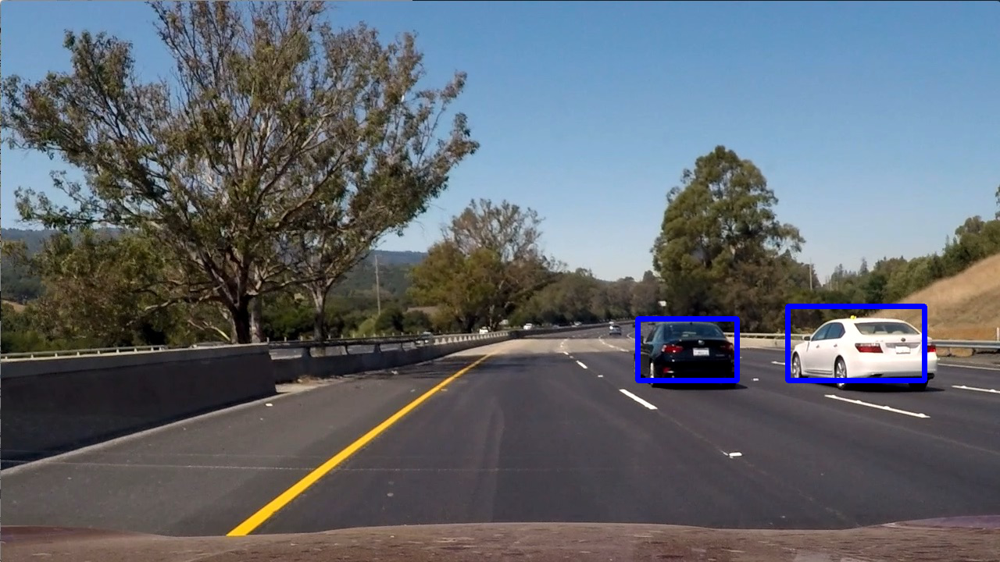 |

Video Implementation
---

Discussion
---
One of the challenge faced in this project is:
Training the SVM classifier. SVM classifier is too slow in sklearn for more features. Optimizing any parameters sometimes would result in an infinite amount of training time and would never return.

The current project is trained only on one class to do binary classification that is car or not car. It would be more challenging if we go for multi-class classification to detect pedestrians, bicycles, trucks, motorcycles, etc.